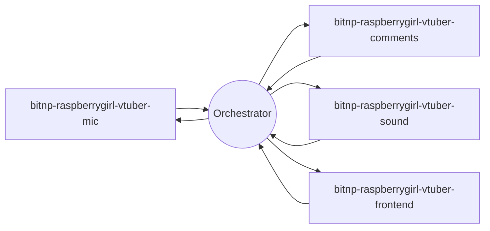

# Distributed AI VTuber Architecture

Orchestrator is the absolute center of this hub-and-spoke system. Mic, Comments, Sound, and the frontend communicate only with Orchestrator.

Canonical contracts live in this repository at `schemas/protocol/envelope.schema.json` and `schemas/protocol/event-data.schema.json`; fixtures live under `schemas/fixtures`. The envelope is closed and includes `schema_version`, `event_type`, `event_id`, `source`, `time`, `trace_id`, `session_id`, `seq`, and `data`.

Mic and Sound use RTP media streams with Orchestrator. `media.stream.command` and `media.stream.state` are canonical. Caption, expression, and action cues are RTP-timed with start/end millisecond and RTP timestamps. `vtuber.scene.command` always carries an explicit positive slide `page`.

Only Orchestrator and the frontend are mode-aware: `lecturer`, `virtual_streamer`, and `onsite_explainer`. Orchestrator owns configurable OpenAI-compatible ASR, LLM, and TTS providers, including vLLM-Omni voice cloning. NATS, JetStream, WebRTC, full RAG, and production Bilibili are deferred.
